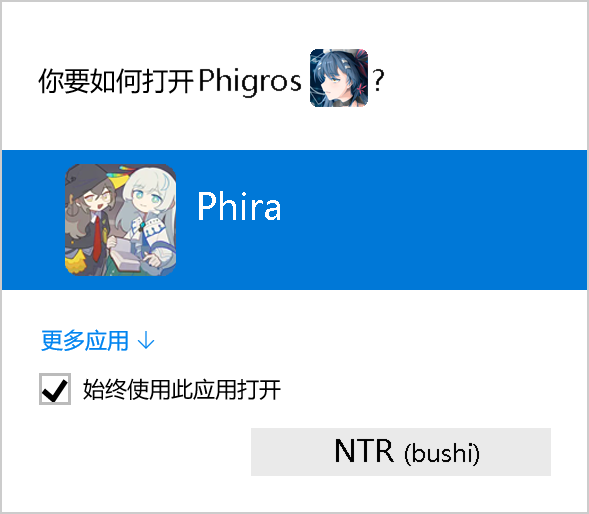

# PhigrosChartTransformer

  

## 简介
这是一个可以将phigros官方谱面转换成phira的pez格式谱面的工具。  
可以全自动（虽然不好用）、半自动使用爬虫收集整理数据，并自动打包整理谱面文件，支持全部难度。
你可以将转制后的谱面导入到phira，从而进行倍速练习、观看奥拓普雷等个人学习用途

请注意，本工具仅供**个人练习**使用，请不要用作商业用途。  
创作不易，请尊重各位老师的成果。  
如有侵权，联系删除。


## 使用

### 在使用之前，你需要确保以下事项：
- 有良好的中文理解能力
- 有一点点英语阅读能力
- 有电脑使用的基础，知道如*压缩*等名词

### 准备
1. 下载release中的程序包，解压。
   
2. 自行上网搜索解包Phigros，将解包好的文件按类型复制到程序的文件夹中。  
    
    **注意**：解包的phigros版本需要与当前数据库文件对应（程序自带的版本为3.10.4）对于更新数据库版本，参见后文。  

    在你解压好的程序目录中：
    - `Charts` 目录下存放原始谱面文件  
      原始谱面文件在解包后的 *TextAsset* 目录下，将其中所有以Chart开头的文件放入即可
    - `Musics` 目录下存放原始音频文件  
      在解包后的 *AudioClip* 目录下，将所有以 *music* 开头的.wav文件放入即可（其他的文件不要）
    - `Illustrations` 目录下存放原始曲绘文件  
      曲绘文件在 *Texture2D* 目录下，将所有以 *Illustration* 开头的.png文件复制到其中即可  
      Texture2D 文件夹下还有很多奇怪的文件，注意不要复制错，特别注意不要复制 *IllustrationBlur* 开头的文件。

---

### 运行
注意，本程序为命令行程序，所有操作均使用键盘输入，按下回车执行。（复制粘贴除外）   
复制：用鼠标选中要复制的文件后直接右键  
粘贴：直接在窗口内右键  
ctrl + c快捷键代表终止程序，不是复制！

1. 打开程序，首先选择 **1** 进行谱面文件生成。此操作将根据程序自带的数据查找并转换文件，全部转换完（约250首）大概要10分钟。
2. 选择 **2** 可以进行数据更新

    >注：本程序将所有歌曲对应的元数据存住在 `.\data\songsInformation.json` 文件中，包括各文件对应关系，因此在phigros更新以后（更新后文件名会发生变动）需要更新数据文件。  
    程序自带的数据文件对应 3.10.4版phigros，请根据需要自行决定是否进行数据更新。  

    默认情况下将会使用半自动模式进行数据更新，请根据程序内的提示完成操作。  

    程序会根据文件md5值来更新文件，因此一定确保所有文件**放置正确**再进行更新。如果发现数据文件损坏，在本站可以找到原始版本的数据文件，替换即可（3个json都要换）

3. 选择 **3** 来重置数据文件
4. 在程序根目录下的 *Output* 文件夹内可以找到按照难度分类好的谱面文件。

---

### 错误处理
程序运行中可能会因各种情况而产生无法收集信息的情况，包括但不限于：
- 听歌识曲搜不出歌或者OCR识别错误（如果启用全自动模式）
- wiki记录的信息有误，导致无法找到对应谱面
- 谱面文件不知道为什么反正就是死活找不到
- 曲绘文件相似度太低导致无法识别
  
你需要手动处理上述情况产生的错误。

打开程序，选择选项 **5** 进行错误处理。  
程序将会显示每种类别的错误个数（一共三种），选择一个选项，根据提示完成错误处理。  

一般情况下，你需要轮流依次处理每一种错误，直到所有选项都归零。  
但是对于某些实在无法处理谱面信息错误，请在错误处理界面选择选项 **4** 来忽略他们。  
目前有以下情况程序无法处理：
- 在所有元数据输入正确的情况下，仍然无法找到谱面。 
- random 的6个隐藏谱 

#### 想要恢复被忽略的谱面？
1. 用各种带查找功能的编辑器打开`./data/songsInformation.json`
2. 查找以下内容（注意换行和缩进），找到的信息就是忽略的歌曲
    ```
    "status": [
        -1,
        -1,
        -1
      ]
    ```
3. 将对应信息中的`"status": [ -1, -1, -1 ]`改为`"status": [ 0, 0, 0 ]`
4. 打开程序，选择**5**进行错误处理，然后选择谱面信息错误处理，手动处理完成即可正常使用。


#### 温馨提醒：
- 请随时备份`.\data\songsInformation.json`，以防止意外情况导致文件损坏。
- 在数据文件无法修复时，可尝试重置数据文件，也可以重新下载github存储库中的文件，  
<br>

## 程序配置
程序配置文件为 `.\config.py`，每个配置项都有说明。  
程序数据目录为`.\data\`，其中有以下文件
- `songsInformation.json` 歌曲元数据存储文件（如曲名、歌手等，以及各文件对应关系。）
- `chartFilenameLUT.json`存储各谱面文件的bpm、物量，供查找使用。
- `illustrateFilenameLUT.json`存储各曲绘的特征，供曲绘查找使用

### 关于全自动模式
因为配置比较麻烦，并且失败率比较高（大概40%），因此默认关闭，建议仅在需要重置数据文件时启用。  

启用后，程序会模拟键盘鼠标来操控电脑上的听歌识曲软件（我用的q音），识别歌名然后用截图ocr（图片转文字）来识别曲名。不同音乐软件逻辑不同，因此可以根据需要自行修改。

### 从源码运行
克隆项目，在根目录下运行
```bash
pip install -r requirements.txt
```
然后运行 `main.py`  即可。
<br>

## 其他
本程序的 谱面查找部分 由此项目修改借鉴而来：[Phi_Chart_Transform](https://github.com/Anslate/Phi_Chart_Transform)  
谱面转换部分 由另外一个github上的项目修改而来，但是截止项目发布日期，我无法重新找到当时的那个项目了。
在此对这两个项目表示感谢。  

作者：B站 *彩云香橙* （只是业余写代码的高中牲，质量不高，请见谅）  
如有bug请反馈在b站私信（虽然我也不一定有时间改）  
项目代码以及转换结果仅供个人练习使用，禁止商用。
